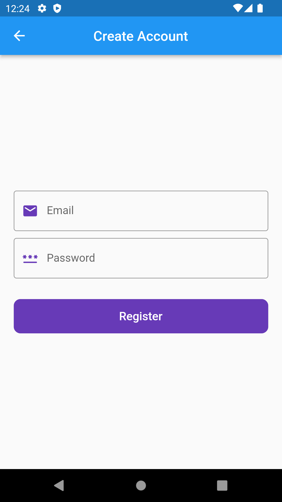
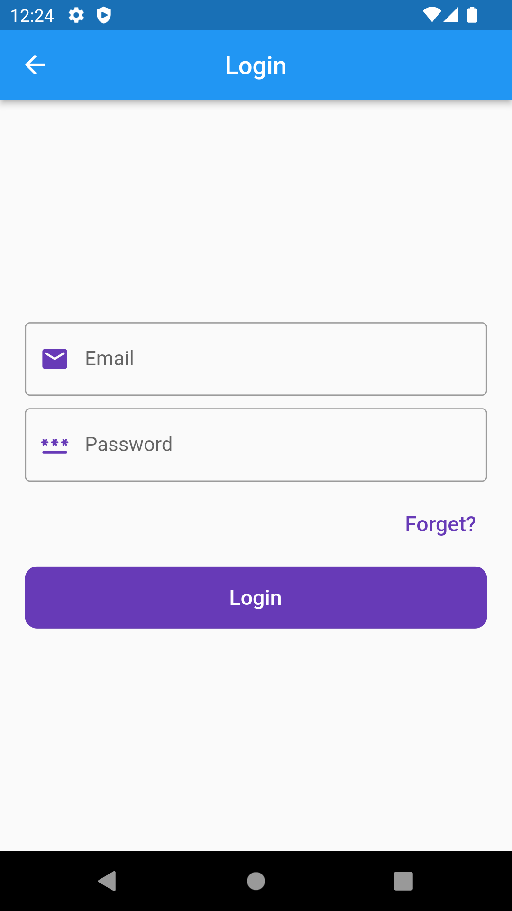
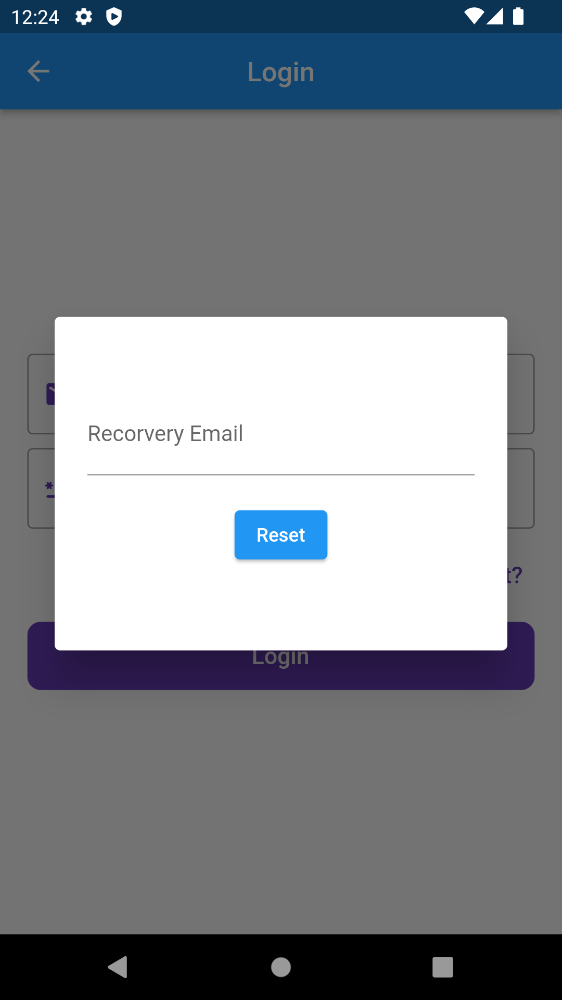
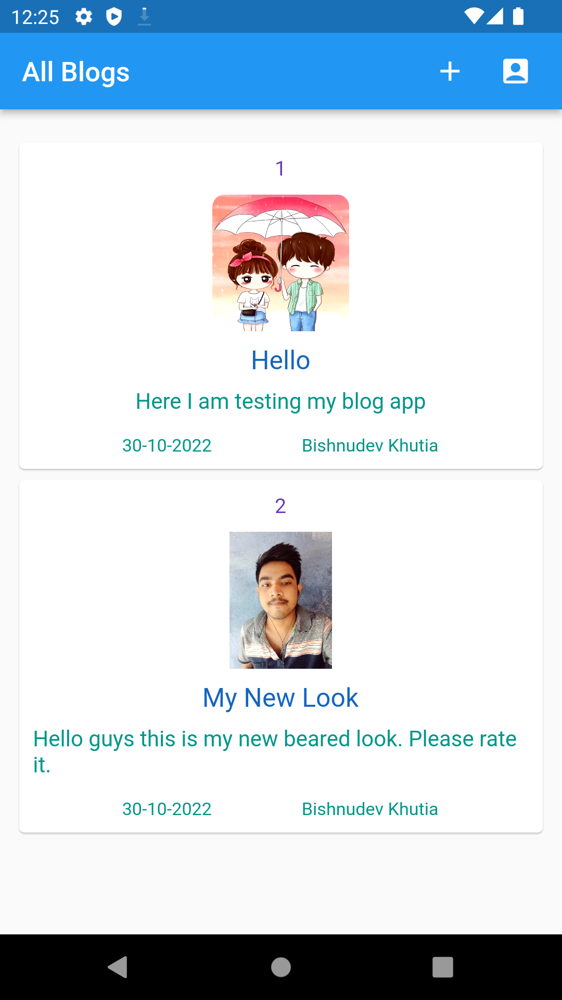
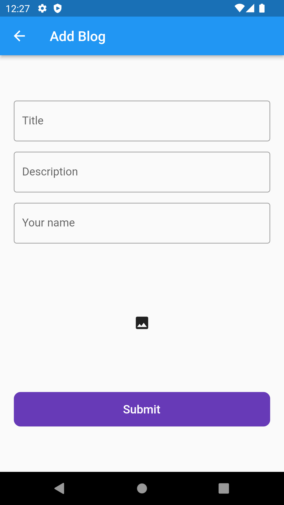

# fireblogs-
Flutter + Firebase Complete Blog App


# Tech Used
## Frontend
- Flutter
## Backend
- Firebase
## Database
- FirebaseAuth - Login and Registration
- FirebaseFirestore - Storing Blogs Data
- FirebaseStorage - Storing Blog Images

## How to start this project in your development enviroment ?
```bash
cd fireblogs && flutter clean
```
```bash
flutter pub get
```
```bash
flutter pub upgrade --major
```
```bash
flutter run
```

## Sample Images of UI Screen
<p float="left" align="middle">







</p>

## if you like my work then please appreciate it with giving it a start 😊
